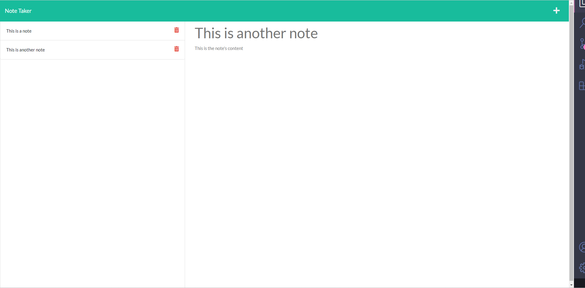

# Note Taker



## Description

This website it to be used to keep track of notes. The user is to create a note and then save a note using the save icon. Then the note will be moved to the left side of the screen. If the user wants to delete the note they can click on the delete button and the remote will be removed. This program was created to help a user organize their notes and have one spot to locate all notes. From this project, the creater learned how to create route folders, and like them to the different api routes.

## Deployed URL

https://peaceful-scrubland-90287.herokuapp.com/notes

## Usage

In the space provided record a note title and the note content. Click on the save button in the top right corner. This will save the note that was created. This will be saved to your local stoarage in the browser. To open the note again after saving, click on the note on the left side. This will bring your note to the main viewer of the program. If you would like to delete the note, click on the red trash can next to the note you want to delete.

## Installation

1. Clone the repo
   ```sh
   git clone https://github.com/hoeferg/note-taker/
   ```
2. Install NPM packages
   ```sh
   npm install
   ```
3. Start the application
   ```sh
   npm start


## License

No license

---

## Contact
Gayle Hoefer - [LinkedIn](https://www.linkedin.com/in/gayle-hoefer-61a2a3124/) - [Github](https://github.com/hoeferg)
